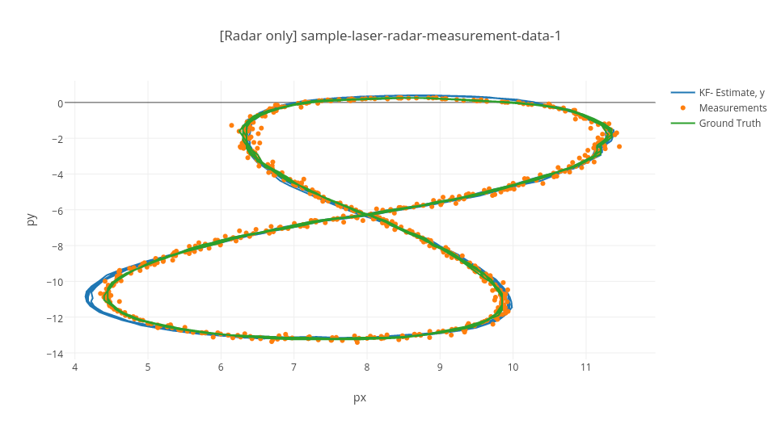

## Extended Kalman Filter

---

**Extended Kalman Filter Project**

The goals / steps of this project are the following:

* Your Sensor Fusion algorithm follows the general processing flow as taught in the preceding lessons.
* Your Kalman Filter algorithm handles the first measurements appropriately.
* Your Kalman Filter algorithm first predicts then updates.
* Your Kalman Filter can handle radar and lidar measurements.
* Your algorithm should meet the specified accuracy requirements when compared to ground truth data

---

## Dependencies

* cmake >= 3.5
 * All OSes: [click here for installation instructions](https://cmake.org/install/)
* make >= 4.1
  * Linux: make is installed by default on most Linux distros
  * Mac: [install Xcode command line tools to get make](https://developer.apple.com/xcode/features/)
  * Windows: [Click here for installation instructions](http://gnuwin32.sourceforge.net/packages/make.htm)
* gcc/g++ >= 5.4
  * Linux: gcc / g++ is installed by default on most Linux distros
  * Mac: same deal as make - [install Xcode command line tools]((https://developer.apple.com/xcode/features/)
  * Windows: recommend using [MinGW](http://www.mingw.org/)

## Basic Build Instructions

1. Clone this repo.
2. Make a build directory: `mkdir build && cd build`
3. Compile: `cmake .. && make`
   * On windows, you may need to run: `cmake .. -G "Unix Makefiles" && make`
4. Run it: `./ExtendedKF path/to/input.txt path/to/output.txt`. You can find
   some sample inputs in 'data/'.
    - eg. `./ExtendedKF ../data/sample-laser-radar-measurement-data-1.txt output.txt`

## Dataflow

1. The measuremennt processor/matlab simulator (see the
[utilities repo](https://github.com/udacity/CarND-Mercedes-SF-Utilities)) is generating the FUSION .txt file:

    "data/obj_pose-laser-radar-synthetic-ukf-input.txt";

    OR

        "../matlab_examples/obj_pose-laser-radar-synthetic-ukf-input.txt";

    The Input file format is:

        #L(for laser) meas_px meas_py timestamp gt_px gt_py gt_vx gt_vy
        #R(for radar) meas_rho meas_phi meas_rho_dot timestamp gt_px gt_py gt_vx gt_vy

    Example:

        R	8.60363	0.0290616	-2.99903	1477010443399637	8.6	0.25	-3.00029	0
        L	8.45	0.25	1477010443349642	8.45	0.25	-3.00027	0

2. The EKF Algorithm reads form file reads all the lines and generates measurement structures

3. The MeasurementProcessor() is called with individual measurements (one by one). The results are saved (Attention: no file processing routines are used inside MeasurementProcessor() all the file processing routines are in the main function so the data read/write is decoupled from the algorithm

4. The results are saved in an output file:

        "data/obj_pose-laser-radar-ekf-output.txt"

  Output file format:

        est_px est_py est_vx est_vy meas_px meas_py gt_px gt_py gt_vx gt_vy

  Example:

        4.53271	0.279	-0.842172	53.1339	4.29136	0.215312	2.28434	0.226323
        43.2222	2.65959	0.931181	23.2469	4.29136	0.215312	2.28434	0.226323

## Results

This code implements an Extended Kalman Filter using measurements from both Radar and Lidar to predict the movement of a bycicle. In the following, the code is applied to the example file sample-laser-radar-measurement-data-1.txt. Influences of radar and lidar data to the overall result are discussed.

#### Sensor fusion, Radar and Lidar data used together

Root mean square error is used to evaluate the performance of the implemented prediction. The estimated state vector and the true state vector (called ground truth) are used here.

Accoracy - RMSE:

variable  |  RMSE value
--|--
px  |  0.0651649
py  |  0.0605378
vx  |  0.54319
vy  |  0.544191

#### Lidar data used only

Accuracy goes down. Quite good in estimating the position but worse in estimating the velocity. That makes sense, as the lidar can only measure positions, not velocities.

variable  |  RMSE value
--|--
px  |  0.0681865
py  |  0.0572297
vx  |  0.625587
vy  |  0.560902

#### Radar data used only

Much worse in estimating the position (than with only radar) but not as bad in estimating the velocity. That makes sense, as the radar is able to measure the velocity rho_dot.

variable  |  RMSE value
--|--
px  |  0.10121
py  |  0.0823314
vx  |  0.613423
vy  |  0.581877
